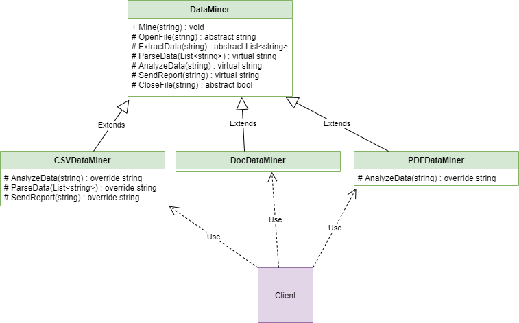

Template method - behavioral design pattern the parent class defines the general algorithm for the behavior of the subclasses, an subclasses change the logic of the steps without changing the structure of the algorithm.

> I think this pattern is outdated, because we use inheritance, of course we can get around this problem with composition, but this approach does not quite use the idea of this pattern correctly.

## When need use this pattern:
- When it is known that in the future the steps of the algorithm will be redefined by the heirs.
- When we want to avoid duplication of code in the descendants.

## Diagram

pros:
- We comply with the DRY principle.

cons:
- There can be only one algorithm structure.
- It is possible to break LSP by changing the behavior of the base class through subclasses.
- We use inheritance because of which we are very dependent on the parent class.